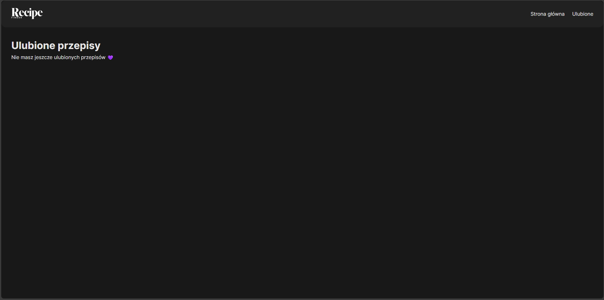

# 🍳 Recipe Finder - React SPA

**Znajdź przepisy po składnikach!**  
Aplikacja pozwala użytkownikom wyszukiwać przepisy kulinarne, dodawać je do ulubionych oraz przeglądać szczegóły każdego przepisu.

---

## 📌 Funkcjonalności

- 🔹 Wyszukiwanie przepisów po podanych składnikach  
- 🔹 Wyświetlanie wyników w formie responsywnych kart  
- 🔹 Szczegółowa strona przepisu: zdjęcie, składniki, instrukcje, czas przygotowania, ilość porcji  
- 🔹 Dodawanie / Usuwanie przepisów do / z ulubionych (localStorage)  
- 🔹 Strona **Ulubione** – lista zapisanych przepisów  
- 🔹 Responsywność (mobile-first design)  
- 🔹 Animacje przy wczytywaniu kart i dodawaniu do ulubionych (Framer Motion)  
- 🔹 Zachowanie stanu wyszukiwania po powrocie ze strony szczegółów  

---

## ⚙️ Instalacja i uruchomienie

1. **Sklonuj repozytorium**  
```bash
git clone https://github.com/TWOJ_USERNAME/recipe-finder.git
cd recipe-finder
```
2. **Zainstaluj zależności**
```bash
npm install
```
3. **Uruchom projekt**
```bash
npm run dev
```
4. **Otwórz w przeglądarce**
http://localhost:5173

---

## 📚 Użyte biblioteki

| Biblioteka | Cel użycia |
|------------|-----------|
| React | Główna biblioteka SPA |
| React Router DOM | Routing i nawigacja między stronami |
| Framer Motion | Animacje przy wczytywaniu kart i dodawaniu do ulubionych |
| Spoonacular API | Źródło przepisów kulinarnych |

---

## 📸 Screenshots

**Strona główna**  
  

**Szczegóły przepisu**  
  

---

## 🧩 Architektura i komponenty


- **Navbar** – nawigacja między stronami  
- **SearchForm** – formularz do wpisania składników  
- **RecipeCard** – karta przepisu (zdjęcie, tytuł, liczba polubień, dodawanie do ulubionych)  
- **RecipeList** – lista kart przepisów  
- **RecipeDetails** – szczegóły przepisu z przyciskiem ulubionych  
- **Favorites** – wyświetlanie zapisanych przepisów  

---

## ⚡ Trudności i rozwiązania

- **Problem:** zachowanie wpisanych składników po powrocie z podstrony  
  - **Rozwiązanie:** użycie `URLSearchParams` do przechowywania wartości wyszukiwania w URL  
- **Problem:** dodawanie i usuwanie ulubionych z localStorage  
  - **Rozwiązanie:** stworzenie `favoriteService.js` do zarządzania zapisanymi przepisami  

---

## 🚀 Future Improvements

- Sortowanie przepisów po czasie przygotowania lub popularności  
- Możliwość filtrowania po typie dania (śniadanie, obiad, deser)  
- Animacje serduszka przy dodaniu do ulubionych  

---

## ⚠️ Known Issues

- Instrukcje niektórych przepisów mogą być puste w Spoonacular API  
- Ograniczone do 16 przepisów na wyszukiwanie  

---

## 🔗 Live Demo

[https://TWOJ_GITHUB_PAGES_LINK](https://TWOJ_GITHUB_PAGES_LINK)
